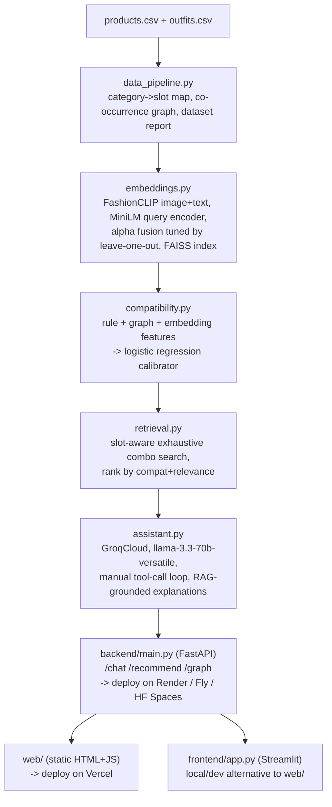

# AI Fashion Outfit Recommendation System

MVP for DarexAI's ML assignment: conversational outfit recommender over a
68-product / 25-curated-outfit catalog, using FashionCLIP + a graph/rule/
learned compatibility engine + **GroqCloud** (not Gemini, not xAI's Grok)
for the conversational layer. Frontend on Vercel, backend on a separate
free container host -- see "Deployment" for why it's split that way.

(Original dataset documentation preserved in `DATASET_README.md`.)

## Architecture



Each pipeline stage writes to `./processed/` and is read by the next. Run
stages A-D in order, once, locally (only `embeddings.py` is slow / needs
real internet for model downloads). E-H are the serving layer.

## Why this stack

68 items / 25 outfits is too small to train any deep model from scratch.
The architecture is frozen pretrained embeddings (FashionCLIP) + a real
co-occurrence graph (free, exact, from the 25 outfits) + hand-built rules
(slot/occasion/color) + a small logistic-regression *calibrator* that
learns how to weigh those signals, validated by leave-one-outfit-out (the
only defensible scheme at n=25). The LLM never sees raw embeddings -- it
only calls `retrieve_outfit()` and explains already-retrieved real items,
grounded on a real stylist's rationale for the nearest matching
ground-truth outfit.

**Why GroqCloud, not Gemini, not xAI's "Grok":** GroqCloud's free tier
needs no credit card and no data-sharing opt-in -- 30 RPM / 1,000 RPD /
12K TPM per model as of this build (verify current numbers at
console.groq.com, free-tier limits do get revised). xAI's Grok API, a
different product from a different company, is pay-per-token with only a
time-limited signup credit -- not a fit if the constraint is genuinely
$0. Model: `llama-3.3-70b-versatile`; swap to `llama-3.1-8b-instant` in
`assistant.py` if you hit rate limits live.

## Dataset analysis (real, from `data_pipeline.py`'s report)

- 68 products, 25 expert-curated outfits (ground truth).
- Slot distribution: footwear 17, onepiece 13, accessory 13, topwear 10,
  bottomwear 9, layer 6.
- Gender: women 41 / men 27. Occasion: casual 15, party 13, office 12,
  festive 9, wedding 6, sports 5, vacation 4, winter 4.
- **Data bug found and handled:** `wear_type` should only be
  `western`/`ethnic`, but 30/68 rows (every footwear + accessory row) have
  it overwritten with their own slot type instead. `compatibility.py`
  treats this as `unknown` -> neutral score, not a real mismatch.
- No structured color field -- color is extracted via keyword match
  against a vocabulary mined from `outfits.csv`'s real `palette` field.
- `rating` missing on 25/68, `rating_count` missing on 42/68 -- dropped.

Full report: run `data_pipeline.py`, see `processed/dataset_report.txt`.

## Evaluation methodology

- **Alpha fusion + FashionCLIP-vs-vanilla-CLIP ablation:** leave-one-out
  recall@5 over real cross-slot pairs from the 25 outfits, both models,
  run by default in `embeddings.py`. Generate the chart:
  `python make_ablation_chart.py --processed_dir ./processed`.
- **Compatibility calibrator:** leave-one-outfit-out cross-validation,
  with the co-occurrence/color tables rebuilt per fold from only the 24
  training outfits (no leakage from the held-out outfit).
- All of the above are calibration sanity checks at n=25, not
  generalization claims -- say that explicitly in your demo video.
- **Unit tests** (`tests/`, run via `pytest tests/ -v`) cover the
  slot-mapping, featurizer, and retrieval logic against a synthetic
  fixture catalog -- fast, no network/model downloads needed, separate
  from the dataset-analysis/embedding evaluation above.

| Metric | Value |
|---|---|
| Best alpha | see `processed/embeddings_meta.json` after running embeddings.py |
| FashionCLIP recall@5 vs vanilla CLIP | same file -- or `processed/ablation_chart.png` |
| Compatibility leave-one-out accuracy / AUC | printed by `compatibility.py` |

## Run order (local, one-time pipeline + local serving)

```bash
pip install -r requirements.txt -r requirements-dev.txt

python data_pipeline.py --data_dir . --out_dir ./processed
python embeddings.py --data_dir . --processed_dir ./processed   # needs real internet, ~1.3GB models, one-time
python compatibility.py --processed_dir ./processed
python make_ablation_chart.py --processed_dir ./processed       # optional, for docs/video

pytest tests/ -v                                                  # fast, synthetic fixtures, no network

export GROQ_API_KEY="your-key-from-console.groq.com"
uvicorn backend.main:app --reload --port 8000      # terminal 1

streamlit run frontend/app.py                       # terminal 2, OR open web/index.html directly
```

## Deployment (Vercel + a separate backend host -- and why)

**Vercel hosts `web/` only.** It's a zero-config static site (HTML/CSS/JS,
no build step, images bundled in `web/images/`) -- exactly what Vercel is
for. Deploy: `cd web && vercel --prod` (or connect the repo in the Vercel
dashboard, root directory = `web/`).

**Vercel does NOT host the backend.** `backend/main.py` needs
sentence-transformers for query encoding, which pulls in torch
transitively even though FashionCLIP/vanilla-CLIP are deliberately never
loaded at serving time (embeddings are precomputed once, offline, by
`embeddings.py`). That's still too large for Vercel's serverless Python
functions (~250MB unzipped limit on Hobby). Deploy `backend/main.py`
instead to **Render, Fly.io, or a Hugging Face Spaces Docker space** --
all run real containers on a free tier, not size-capped functions. Use
the root `Dockerfile`:

```bash
docker build -t fashion-backend .
docker run -p 8000:8000 -e GROQ_API_KEY=your-key fashion-backend
# or: docker compose up --build
```

Then edit the one line in `web/config.js` to point at your deployed
backend's URL, and redeploy `web/` to Vercel.

## CI

`.github/workflows/ci.yml` runs `pytest tests/` on every push -- fast
(~30s), no heavy ML deps, since the tests use a synthetic fixture catalog
and mock the query encoder. Real dataset/model behavior is exercised by
the run-order commands above, which you run locally, not in CI.

## New in this pass: graph atlas + explainability breakdown

- `GET /graph` (backend) returns the real item-item co-occurrence graph
  from `data_pipeline.py`. `web/`'s "Compatibility Atlas" tab renders it
  with vis-network -- every edge is two items actually styled together by
  a human stylist in the 25 ground-truth outfits, not an assumption.
- Every outfit response now includes `feature_breakdown`: the mean of the
  5 raw compatibility features (visual+text similarity, color harmony,
  co-occurrence, same-occasion, wear-type match) across the outfit's item
  pairs (`compatibility.py:mean_feature_breakdown`). Rendered as bars in
  both `web/` and the Streamlit app -- turns "explainable" into something
  visible, not just a sentence.

## Known limitations

- n=25 outfits: any learned number here is a calibration signal, not a
  generalization guarantee.
- Binary gender only (matches the dataset).
- `wear_type` is unreliable for footwear/accessory rows (data bug,
  handled as neutral rather than silently trusted).
- Color matching is keyword-based against a 15-token vocabulary mined
  from `outfits.csv` -- doesn't generalize beyond those tokens.
- `assistant.py`'s live Groq chat loop was not tested against a real
  GROQ_API_KEY in this build environment (no network egress to
  api.groq.com here) -- the manual tool-call loop logic itself was
  tested with a mocked client standing in for the real API response
  shape. The Dockerfile/docker-compose were not build-tested here either
  (no docker CLI/registry access in this sandbox) -- both are standard
  enough patterns that this is a low-risk gap, but budget time to verify
  on a real Docker host before you rely on them for the live demo.

## Future improvements

- Replace the 25-outfit-derived calibrator with a real Polyvore-scale
  compatibility dataset once available -- architecture carries over
  unchanged, only the training data size changes.
- Add a structured `base_colour` field at the data source instead of
  extracting color from free text.
- Redis/DB-backed chat sessions if this needs to survive backend
  restarts or run multi-process (currently in-memory, fine for a demo).
